# My Personal Neovim Configuration

> [!WARNING]
> This config sucks. Proceed with caution.

This is my messy Neovim setup that I use for everyday coding ([PDE](https://www.youtube.com/watch?v=QMVIJhC9Veg&t=470s)).

I mainly use arrow keys, cause neovim let me lol

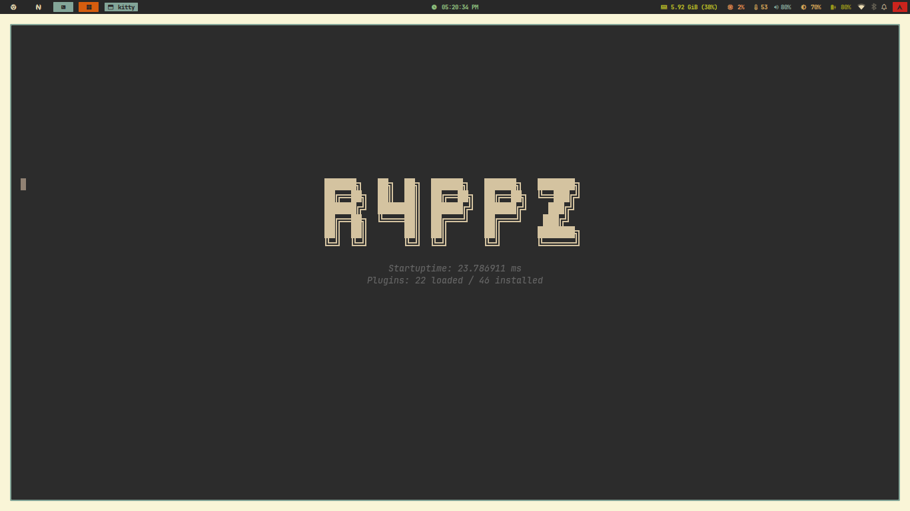 

Screenshots

> Some of the things I liked:

|                                                                         |                                                                             |
| ----------------------------------------------------------------------- | --------------------------------------------------------------------------- |
| 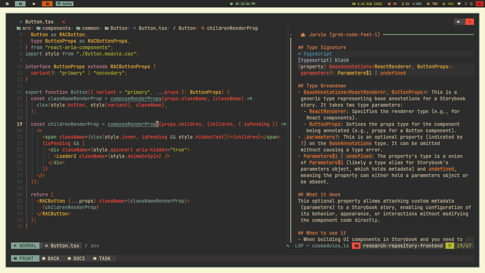 Copilot AI                       | 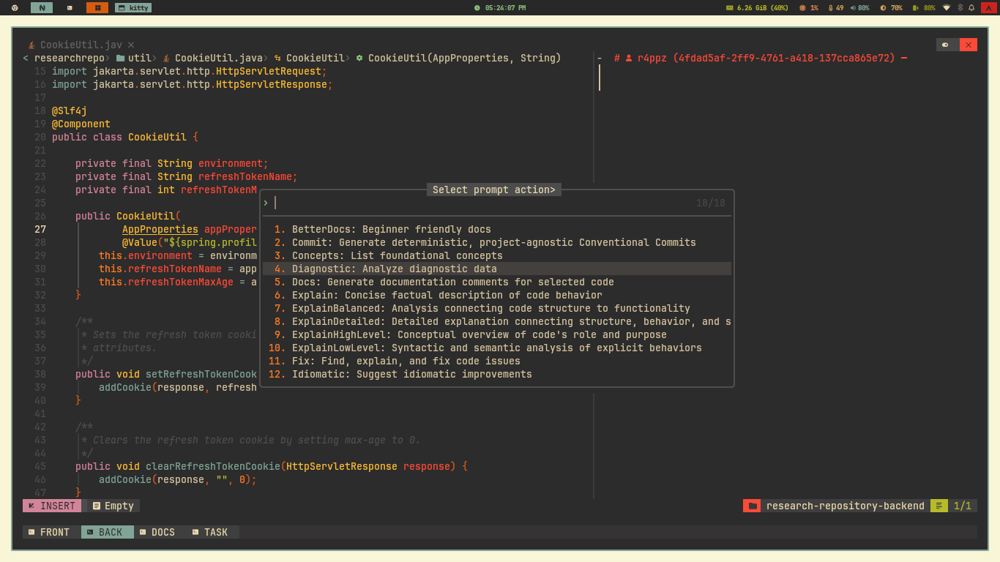 AI Prompts                      |
| 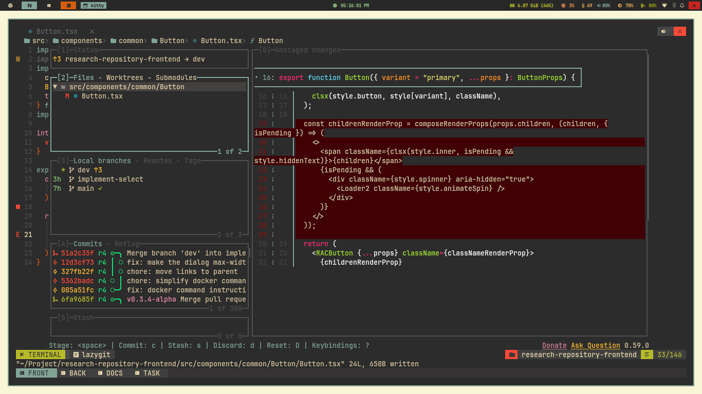 LazyGit                  | 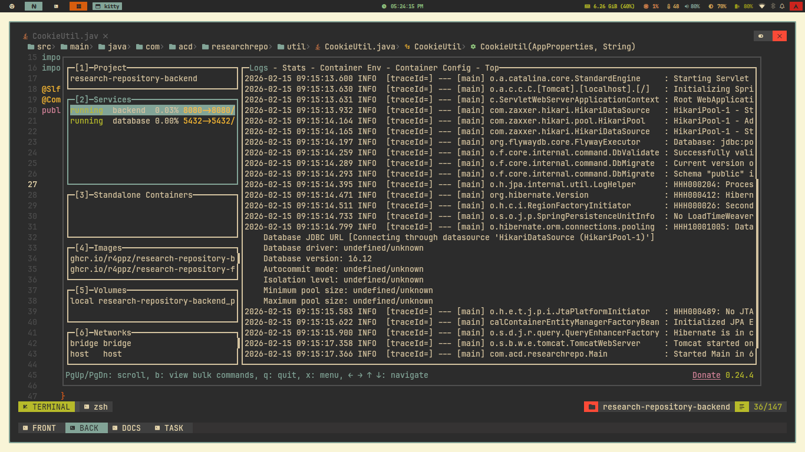 LazyDocker                       |
| 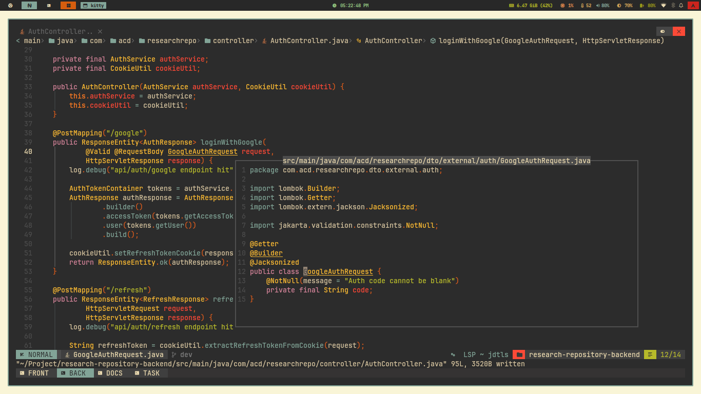 Peek Definition     | 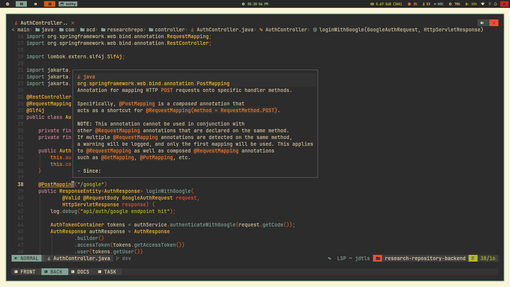 Hover                             |
| 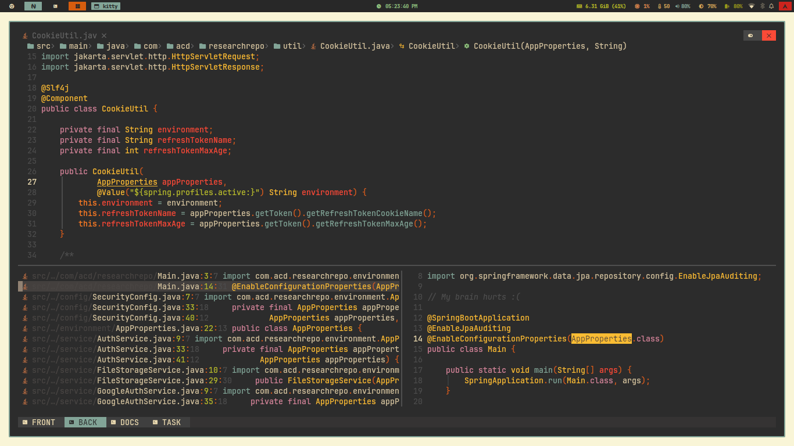 References               | 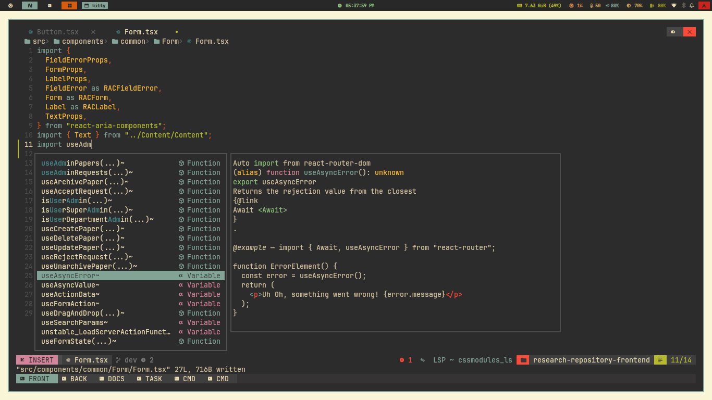 Completion Menu                     |
| 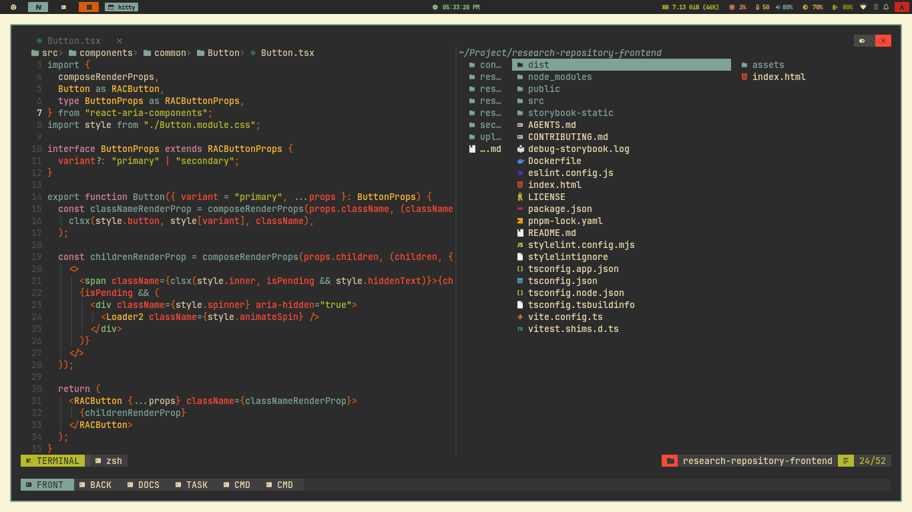 Vertical Terminal | 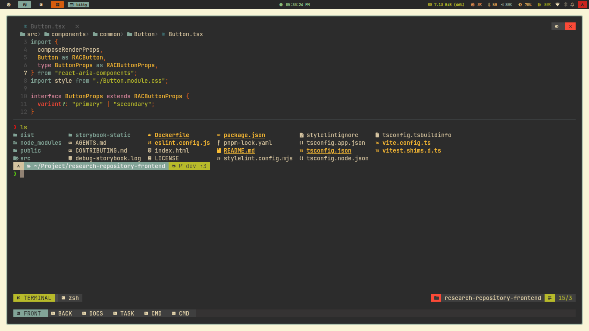 Horizontal Terminal |
| 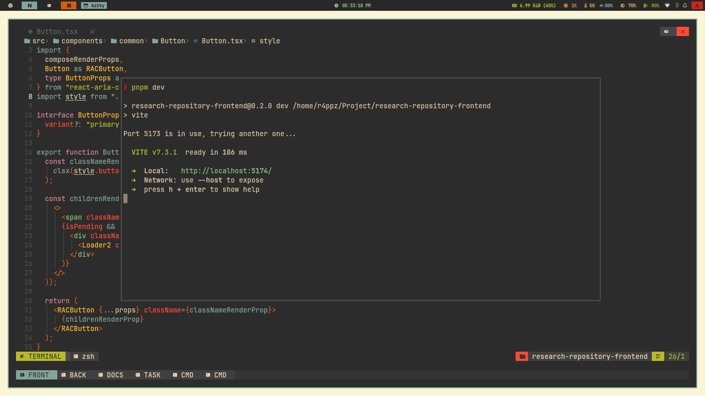 Floating Terminal | 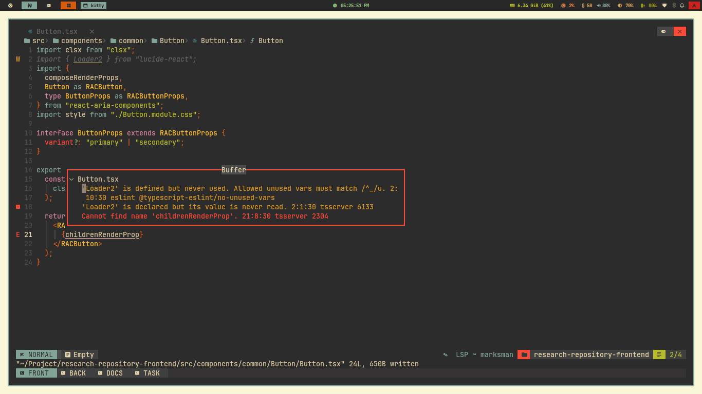 Error Display                     |
| 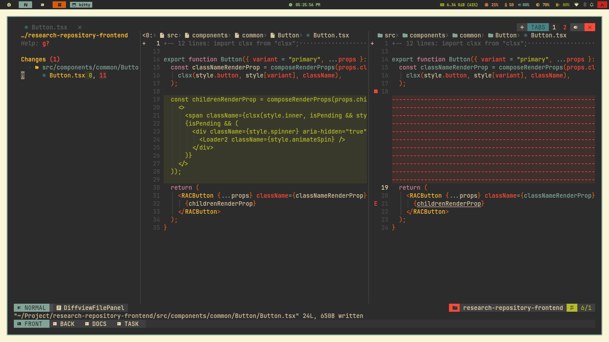 DiffView                       | 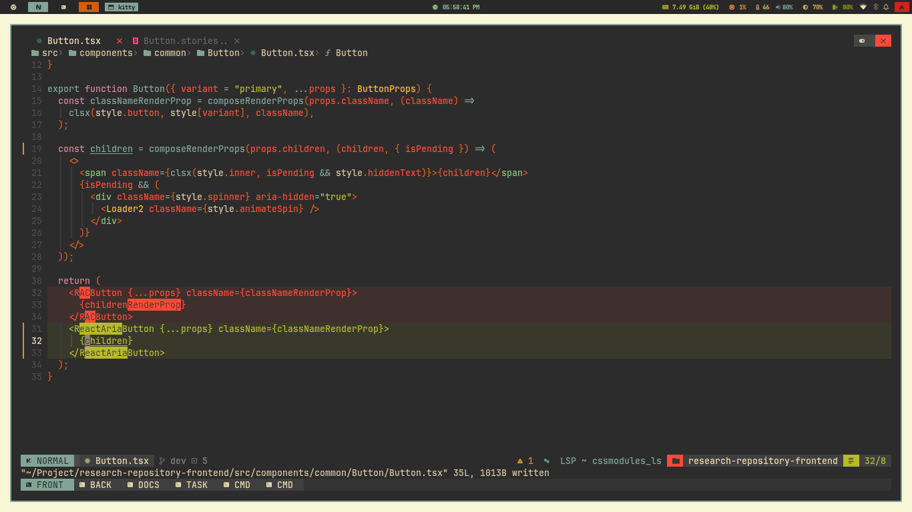 Inline Diff                 |
| 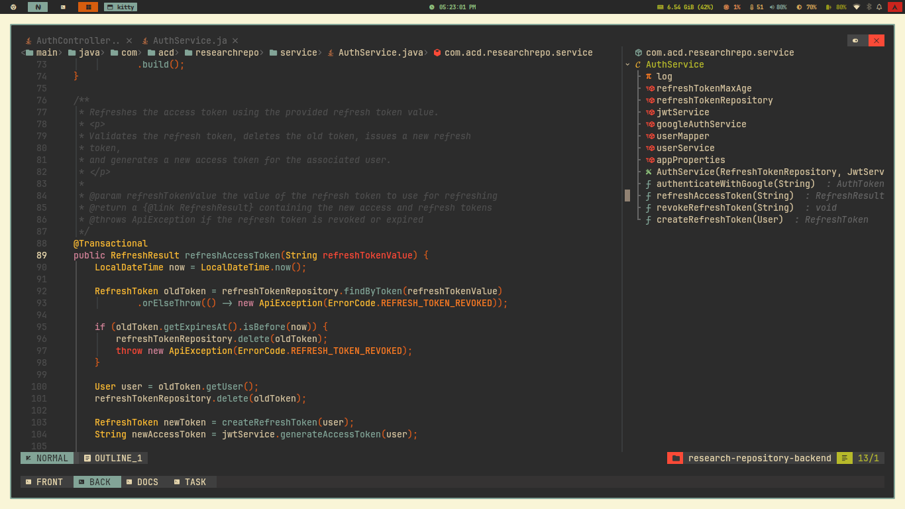 Symbols Outline             | 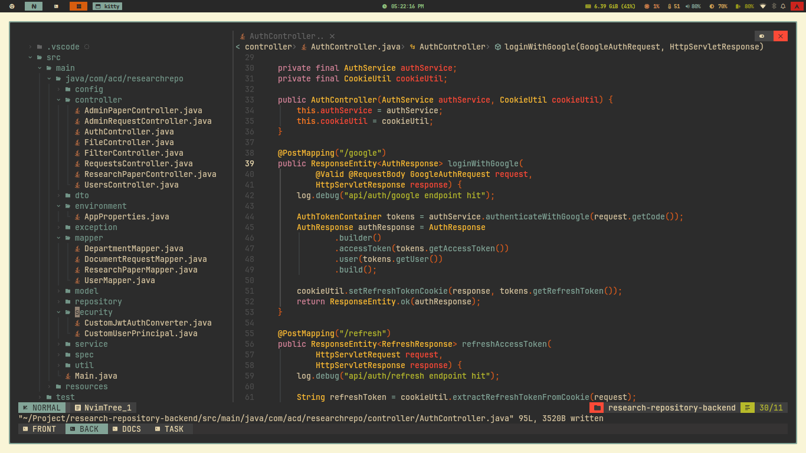 File Manager               |
