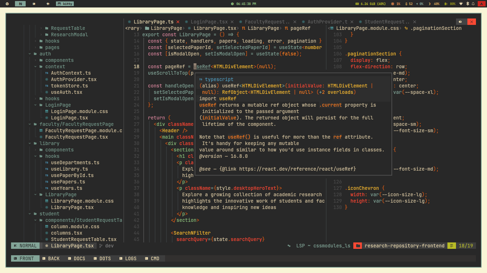

# My Personal Neovim Configuration

> [!WARNING]
> This configuration will probably not work for you. I basically created my own editor and development environment (IDE). This
> is not idiomatic or follows neovim/vim philosophy. I use a lot of plugins and arrow keys just because neovim let me :p

---

More screenshots

> Some of the things I liked:

|                                                                         |                                                                             |
| ----------------------------------------------------------------------- | --------------------------------------------------------------------------- |
|  Copilot AI                       |  AI Prompts                      |
|  LazyGit                  |  LazyDocker                       |
|  Peek Definition     |  Hover                             |
|  References               |  Completion Menu                     |
|  Picker                       |  Horizontal Terminal |
|  Floating Terminal |  Vertical Terminal     |
|  DiffView                       |  Inline Diff                 |
|  Symbols Outline             |  File Manager               |
|  Error Display                 |                                                                             |

---

The [keybinds](lua/configs/mappings/custom.lua) aren't really Vim-idiomatic since I use a lot of arrow keys, some weird combinations like Ctrl+Shift+ArrowKey, and also a lot of the Alt key. I also unbound some defaults like macros, etc. I basically recreated the way normal GUI editors do it like Ctrl+Left to skip a word etc. Then added my own (other vim features) that I think are ergonomic and fit perfectly with my keyboard layout.

The tmux/hyprland/waybar config can be found in this repo: [Arch-dotfiles](https://github.com/r4ppz/Arch-dotfiles)

## Plugins:

> its a lot 😬

Start up time is still below 1sec (`~23 miliseconds`) so I think it's still super duper fast compared to VSCode/IDE.

- lazy.nvim
- base46
- ui
- volt
- menu
- nvim-lspconfig
- mason.nvim
- mason-lspconfig.nvim
- nvim-lsp-file-operations
- lspsaga.nvim
- typescript-tools.nvim
- nvim-jdtls
- nvim-lint
- conform.nvim
- nvim-treesitter
- nvim-cmp
- LuaSnip
- cmp-nvim-lsp
- cmp-nvim-lua
- cmp_luasnip
- cmp-buffer
- cmp-async-path
- friendly-snippets
- nvim-autopairs
- mini.surround
- vim-matchup
- indent-blankline.nvim
- vim-illuminate
- nvim-tree.lua
- yazi.nvim
- snacks.nvim
- gitsigns.nvim
- diffview.nvim
- copilot.lua
- CopilotChat.nvim
- nvim-spectre
- markdown-preview.nvim
- render-markdown.nvim
- dashboard-nvim
- dropbar.nvim
- outline.nvim
- hover.nvim
- which-key.nvim
- nvim-web-devicons
- gx.nvim
- screenkey.nvim
- todo-comments.nvim
- plenary.nvim
- telescope.nvim
